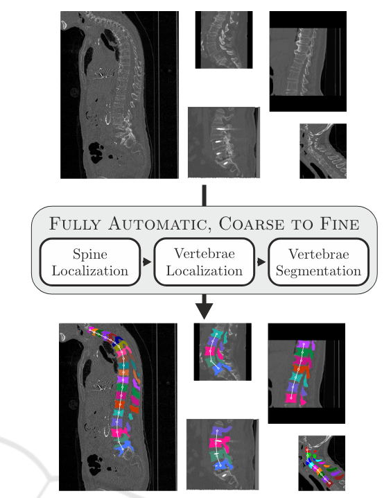
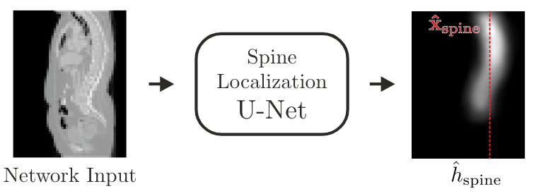
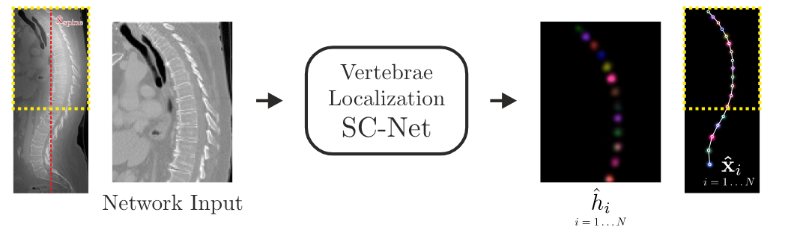

# Coarse to Fine Vertebrae Localization and Segmentation with SpatialConfiguration-Net and U-Net
>
> Christian Payer1,2 a
> , Darko Stern ˇ 1,2 b
> , Horst Bischof2 c
> and Martin Urschler1,3 d
> 1Ludwig Boltzmann Institute for Clinical Forensic Imaging, Graz, Austria
> 2
> Institute of Computer Graphics and Vision, Graz University of Technology, Graz, Austria
> 3School of Computer Science, The University of Auckland, Auckland, New Zealand
> Keywords: Vertebrae Localization, Vertebrae Segmentation, SpatialConfiguration-Net, U-Net, VerSe 2019 Challenge.

## 摘要: 

从脊柱CT体积中定位和分割椎体对于病理诊断、手术计划和术后评估至关重要。然而，由于病理的解剖变异、螺钉和植入物引起的噪音以及不同视野的大范围，脊柱CT体积的全自动分析是困难的。我们提出了一种基于全卷积神经网络的全自动脊椎定位和分割方法。在三步方法中，首先，U-Net定位脊椎的粗略位置。然后，空间配置网络使用热图回归进行椎骨定位和识别。最后，U-Net以高分辨率对每个识别的椎骨执行二进制分割，然后将各个预测合并到所产生的多标签椎骨分割中。评估显示，我们的方法表现最佳，排名第一，并赢得了MICCAI 2019大规模脊椎分割挑战赛（VerSe 2019）

> 关键词: 椎骨定位、椎骨分割、空间配置网络、U-Net、VerSe 2019 挑战赛。

## 概述

  从脊柱CT体积中定位和分割椎体是涉及脊柱的许多临床应用的关键步骤，例如病理诊断（Forsberg等人，2013）、手术计划（Knez等人，2016）和术后评估（Amato等人，2010）。由于椎骨的结构高度重复，包括骨折和植入物在内的不同病变的外观变化很大，以及视野不同，大多数椎体定位和分割方法都是基于机器学习的。由于定位和分割本身都是困难的任务，因此大多数提出的方法只关注一个任务。
......
我们在本文中的主要贡献是：
    - 我们开发了一种从粗到细的全自动方法，用于脊柱CT体积中椎骨的定位、识别和分割。我们首先粗略定位脊椎，然后定位和识别单个脊椎，最后以高分辨率分割每个脊椎。
    - 我们通过首先进行定位和识别步骤，然后对单独识别的椎骨进行二元分割，来解决在存在高度重复结构的情况下同时分割和标记椎骨的挑战性问题。
    - 我们在MICCAI 2019大规模脊椎分割挑战赛（VerSe 2019）中对最先进的方法进行了评估和比较，该挑战赛涉及图像组成和病理学的真实世界条件。我们提出的方法实现了最高性能，排名第一，并赢得了2019年VerSe挑战赛。

## 方法

我们提出了一种三步骤的全自动脊柱CT体积分析方法(见图1):

1. 粗略定位:U-Net首先定位脊柱并生成一个热图,表示脊柱轴线的可能位置。
2. 椎体定位和识别:空间配置网络使用U-Net生成的热图作为输入,回归出每个椎体的中心点坐标。同时给出每个椎体的识别标签。
3. 高分辨率分割:对每个已识别的椎体,U-Net进行二值分割,生成单独的分割标签集。最后将所有分割结果合并成最终的多标签椎体分割结果。

### 1. 脊柱定位

由于视野的变化，脊柱CT体积通常包含许多不包含有用信息的背景，而脊柱可能不在体积的中心。为了确保脊椎在随后的脊椎定位步骤的输入处居中，作为第一步，我们预测脊椎的近似$x$和$y$坐标$\hat{x}_{spine} \in R^2$。为了定位$\hat{x}_{spine}$，我们使用U-Net的变体（Ronneberger等人，2015）来执行脊柱中心线（即通过所有脊椎质心的线）的热图回归（Tompson等人，2014；Payer等人，2016）。目标热图体积$h_{spine}(x;\sigma_{spine}):R^3 \rightarrow R$是通过将所有单个椎骨目标坐标$\hat{x}_i$的大小为$\sigma_{spine}$的高斯热图合并到单个体积中而生成的（见图2）。我们使用L2-Loss来最小化目标热图体积$h_{spine}$和预测热图体积$\hat{h}_{spine}(x: \sigma_{spine}):R^3 \rightarrow R$之间的差异。最终预测的脊椎坐标为$\hat{x}_{spine}$的质心的$x$和$y$坐标。

我们对U-Net的变体进行了调整，使其执行平均而不是最大池化，并执行线性上采样而不是转置卷积。它使用五个级别，其中每个卷积层具有$[3 \times 3 \times 3]$的内核大小和64个滤波器输出。此外，卷积层使用零填充，使得网络输入和输出大小保持相同。

在处理脊椎CT体积之前，将其重采样为8 mm的均匀体素间距，并以网络输入为中心。网络输入分辨率为[64×64×128]，允许范围高达[512×512×1024]mm的脊柱CT体积适应网络输入。该范围足以使网络预测评估数据集的所有脊柱CT体积的$x_{spine}$。

### 2. 椎体定位

为了定位椎体，我们使用（Payer等人，2019）中提出的空间配置网络（SC-Net）。该网络有效地将标记的局部外观与其空间配置相结合。网络的局部外观部分使用五个级别，每个级别包含两个卷积层，然后降采样到较低级别，然后是两个卷积层，然后与上采样的较低级别连接。每个卷积层使用泄漏的ReLU激活函数，并具有[3×3×3]和64个滤波器输出的内核大小。空间配置部分由四个卷积组成，内核大小为[7×7×7]，并以一行处理，以局部外观部分的四分之一分辨率进行处理。SC-Net执行N目标椎体$v_i$的热图回归，即每个目标坐标$\hat{x}_i$表示为以$\hat{x}_i$为中心的高斯热图体积$h_i(x;\sigma_i):R^3 \rightarrow R$。对于N目标椎体$v_i$，网络同时预测所有N个输出热图体积$\hat{h}_i(x):R^3 \rightarrow R$。作为损失函数，我们使用修改后的L2-Loss函数，该函数还允许学习目标高斯热图体积$\hat{h}_i$的单独$\sigma_i$值：

$$

L = \sum_{i=1}^N \sum_x ||\hat{h}_i(x) - h_i(x;\sigma_i)||^2_2 + \alpha ||\sigma_i ||^2_2. (1)

$$

更多细节网络构架和损失函数，请参见（Payer等人，2019）。

图3显示了如何处理输入体积以预测所有热图$\hat{h}_i$的示意图。每个网络输入体积被重采样为均匀的2 mm体素间距，而网络被设置为输入大小为[96×96×128]，这允许体积的范围为[192×192×256]mm适合网络中。由于这种范围，许多数据集的图像无法一次处理。为了将处理的体积缩小到脊柱的大致位置，我们将网络输入置于预测的脊柱坐标$x_{spine}$处（见第2.1节）。此外，由于一些脊柱CT体积在z轴（即垂直于轴）上具有较大的范围，这些体积无法适合网络中，因此我们处理这些体积与（Payer等人，2019）提出的方式相同。在训练期间，我们在z轴的随机位置裁剪子体积。在推理期间，我们将z轴上的体积分割成多个重叠的子体积，每个子体积重叠96个像素，并依次处理它们。然后，我们通过在所有预测中取最大响应来合并重叠子体积的网络预测。

图3显示了如何处理输入体积以预测所有热图hõi的示意图。每个网络输入体积都被重新采样，以具有2mm的均匀体素间距，而网络是为大小为[96×96×128]的输入设置的，这允许范围为[192×192×256]mm的体积适应网络。在这种程度上，数据集的许多图像不适合网络，无法同时处理。为了将处理后的体积缩小到脊椎的大致位置，我们将网络输入集中在预测的脊椎坐标x⏴脊椎（见第2.1节）。此外，由于一些脊椎CT体积在z轴（即垂直于轴向平面的轴）上有更大的范围，不适合网络，我们以与（Payer等人，2019）提出的相同方式处理这些体积。在训练过程中，我们在z轴的随机位置裁剪子体积。在推断过程中，我们将z轴上的体积拆分为多个子体积，这些子体积重叠96个像素，并依次进行处理。然后，我们通过对所有预测取最大响应来合并重叠子卷的网络预测。

我们预测最终的地标坐标$\hat{x}$如下：对于每个预测的热图体积，我们检测到高于特定阈值的多个局部热图最大值。然后，我们通过分别获取最接近体积顶部或底部的最大值的热图来确定体积上可见的第一块和最后一块椎骨。我们通过采用不违反以下条件的序列来确定最终预测的界标序列：连续椎骨可能不小于12.5 mm，距离不大于50 mm，以及以下界标可能不在前一个界标之上。

### 3. 椎体分割

2.3 Vertebrae Segmentation

For creating the final vertebrae segmentation, we use
a U-Net (Ronneberger et al., 2015) set up for binary
segmentation to separate a vertebra from the background (see Fig. 4). The final semantic label of a
vertebra is identified through the localization label as
predicted by the vertebrae localization network (see
Sec. 2.2). Hence, we use a single network for all
Coarse to Fine Vertebrae Localization and Segmentation with SpatialConfiguration-Net and U-Net
127
Vertebrae
Segmentation
U-Net
Network Input
Figure 4: Input volume and segmented vertebrae of the spine segmentation network. The yellow rectangle shows the cropped
region around a single vertebrae vi and indicates that each localized vertebra xˆi
is processed individually. Each individual
vertebra sigmoid prediction ˆli
is then transformed and resampled back to the original position. The final multi-label segmentation ˆlfinal is obtained by setting the label at each voxel to the label of ˆli
that has the largest response.
vertebrae vi
, as the network does not need to identify, which vertebra it is segmenting, but it only needs
to separate each vertebra individually from the background.
Since each vertebra is segmented independently,
the network needs to know, which vertebra it should
segment in the input volume. Thus, from the whole
spine CT image, we crop the region around the localized vertebra, such that the vertebra is in the
center of the cropped image. During training, we
use the ground-truth vertebra location ∗
xi
, while during inference, we use the predicted vertebra coordinate xˆi
. Additionally, we create an image of a Gaussian heatmap centered at the vertebra coordinate xˆi
.
Both the cropped and the heatmap image are used
as an input for the segmentation U-Net. The U-Net
is modified as described in Sec. 2.1. It is set up to
predict a single output volume ˆli(x) : R
3 → (0,1),
while the sigmoid cross-entropy loss is minimized
to generate predictions close to the target binary label volume
∗
li(x) : R
3 → {0,1}. The input volumes
are resampled to have a uniform voxel spacing of
1 mm, while the network is set up for inputs of size
[128 × 128 × 96], which allows volumes with an extent of [128×128×96] mm.
To create the final multi-label segmentation result,
the individual predictions of the cropped vertebra inputs need to be merged. Therefore, the sigmoid output volumes ˆli of each cropped vertebrae i are transformed and resampled back to their position in the
original input volume. Then, for each voxel in the final label image ˆlfinal(x): R
3 → {0...N}, the predicted
label is set to the label i of the vertebra that has the
largest sigmoid response. If for a pixel no vertebra
prediction ˆli has a response > 0.5, the pixel is set to
be the background.
3 EVALUATION
We evaluate our proposed framework for multi-label
spine localization and segmentation on the dataset of
the VerSe 2019 challenge1
. The dataset consists of
spine CT volumes of subjects with various pathologies, where every fully visible vertebra from C1 to
L5 is annotated. As some subjects contain the additional vertebra L6, at maximum N = 25 vertebrae are
annotated. The training set consists of 80 spine CT
volumes with corresponding ground-truth centroids ∗
xi
and segmentations
∗
li for each vertebra vi
.
The VerSe 2019 challenge contains two test sets.
The first test set consists of 40 publicly available spine
CT volumes with hidden annotations. The participants of the challenge had to submit the predictions
on the first test set to the evaluation servers, which
did in turn evaluate and rank the submitted results on
a public leaderboard. The second test set consists of
an additional 40 hidden spine CT volumes. To obtain evaluation results on the second test set, the challenge participants had to submit a Docker image of
the proposed method that creates the predictions. The
organizers of the challenge then performed an internal evaluation on the hidden second test set. The final
rank of each participant of the VerSe 2019 challenge
is defined by the performance on the 80 CT volumes
of both test sets and was announced at the workshop
of MICCAI 2019 (Sekuboyina, 2019).
3.1 Implementation Details
Training and testing of the network were done in Tensorflow2
, while we perform on-the-fly data prepro1<https://verse2019.grand-challenge.org/>
2<https://www.tensorflow.org/>
VISAPP 2020 - 15th International Conference on Computer Vision Theory and Applications
128
Table 1: Results of a three-fold cross-validation on the VerSe 2019 challenge training set consisting of 80 volumes. The table
shows results grouped by cervical, thoracic, and lumbar vertebrae, as well as results for all vertebrae combined.
Vertebrae vi
PEi (in mm)
mean ± SD
IDi
% (#identified of #total)
Dicei
mean ± SD
Hi (in mm)
mean ± SD
Cervical (i = C1...C7) 7.45 ± 8.70 91.07% (102 of 112) 0.91 ± 0.10 5.88 ± 9.50
Thoracic (i = T1...T12) 5.56 ± 6.31 88.99% (388 of 436) 0.93 ± 0.14 6.78 ± 16.67
Lumbar (i = L1...L6) 4.48 ± 2.08 90.45% (284 of 314) 0.96 ± 0.02 6.41 ± 9.05
All (i = C1...L6) 5.71 ± 6.28 89.79% (774 of 862) 0.94 ± 0.11 6.53 ± 13.49
cessing and augmentation using SimpleITK3
. We performed network and data augmentation hyperparameter evaluation on initial cross-validation experiments
using the training set of the VerSe 2019 challenge.
All networks are trained with a mini-batch size of 1,
while the spine localization network is trained for
20,000 iterations, the vertebrae localization network
for 100,000 iterations, and the vertebrae segmentation network for 50,000 iterations. For the U-Net we
use the Adam optimizer (Kingma and Ba, 2015) with
a learning rate of 10−4
, for the SC-Net we use the
Nesterov (Nesterov, 1983) optimizer with a learning
rate of 10−8
. The spine and vertebrae localization networks use L2 weight regularization factor of 5−4
, the
vertebrae segmentation network uses a factor of 10−7
.
We set σspine = 3 pixel for the spine localization network; Same as in (Payer et al., 2019), we set α = 100
in (1) for learning the size σi of the target heatmaps
∗
hi
in the vertebrae localization network.
Due to the different orientations, each CT volume is transformed into a common orientation for
further processing. Furthermore, to reduce noise on
the input volumes, they are smoothed with a Gaussian kernel with σ = 0.75 mm. To obtain an appropriate range of intensity values for neural networks,
each intensity value of the CT volumes is divided
by 2048 and clamped between −1 and 1. For data
augmentation during training, the intensity values are
multiplied randomly with [0.75,1.25] and shifted by
[−0.25,0.25]. The images are randomly translated by
[−30,30] voxels, rotated by [−15◦
,15◦
], and scaled
by [−0.85,1.15]. We additionally employ elastic deformations by randomly moving points on a regular
6×6 pixel grid by 15 pixels and interpolating with 3rd
order B-splines. All augmentation operations sample
randomly from a uniform distribution within the specified intervals.
Training took ≈ 3:30 h for the spine localization
network, ≈ 28:00 h for the vertebrae localization network, and ≈ 12:00 h for the vertebrae segmentation
network, on an Intel Core i7-4820K workstation with
an NVIDIA Titan V running Arch Linux. The inference time is dependent on the field-of-view and
3<http://www.simpleitk.org/>
the number of visible vertebrae on the input CT volume. On the 40 volumes of the test 1 set of the VerSe
2019 challenge, inference per volume takes on average ≈ 4:20 m, divided into ≈ 5 s for spine localization, ≈ 45 s for vertebrae localization, and ≈ 3:30 m
for vertebrae segmentation.
3.2 Metrics
The localization performance is evaluated with two
commonly used metrics from the literature, describing localization error in terms of both local accuracy
and robustness towards landmark misidentification.
The first measure, the point-to-point error PE(j)
i
for
each vertebra i in image j, is defined as the Euclidean
distance between the target coordinate ∗
x
(j)
i
and the
predicted coordinate xˆ
(j)
i
. This allows calculation of
the mean and standard deviation (SD) of the point-topoint error for all images overall or only a subset of
landmarks. The second measure, the landmark identification rate IDi
, is defined as the percentage of correctly identified landmarks over all landmarks i. As
defined by (Glocker et al., 2013), a predicted landmark is correctly identified, if the closest ground-truth
landmark is the correct one, and the distance from
predicted to ground-truth position is less than 20 mm.
The segmentation performance is also evaluated
with two commonly used metrics from the literature.
The first measure is the Dice score Dice(j)
i
for each
label i in image j, which is defined as twice the cardinality of the intersection of ground-truth label
∗
l
(j)
i
and predicted label ˆl
(j)
i
divided by the sum of the cardinality of both ground-truth and prediction. The second measure is the Hausdorff distance H
(j)
i
between
ground-truth label
∗
l
(j)
i
and predicted label ˆl
(j)
i
for each
label i in image j, which is defined as the greatest of
all the distances from a point in one set to the closest
point in the other set. For both measures, the mean
and standard deviation for all images over all or only
a subset of labels are calculated.
Coarse to Fine Vertebrae Localization and Segmentation with SpatialConfiguration-Net and U-Net
129
Table 2: Results on the overall VerSe 2019 challenge test set, which is comprised of 40 volumes in test 1 set and 40 volumes
in test 2 set. The table lists all methods that submitted valid localizations or segmentations, which allowed the organizers to
calculate the evaluated metrics. The predictions for vertebrae localization and segmentation of test 1 set were generated and
submitted by the participants, while the predictions of test 2 set were generated by the organizers with the submitted Docker
images. The methods are ranked as described in the VerSe 2019 challenge evaluation report (Sekuboyina, 2019). The metrics
show the mean values for all vertebrae of test 1 and test 2 set, respectively. Entries with a ”–” indicate failure of metric
calculation, because of erroneous or missing predictions, or missing Docker images.
Rank Team Score test 1 set test 2 set
IDall PEall DSCall Hall IDall PEall DSCall Hall
1
st christian payer 0.691 95.65 4.27 0.909 6.35 94.25 4.80 0.898 7.34
2
nd iFLYTEK 0.597 96.94 4.43 0.930 6.39 86.73 7.13 0.837 11.67
3
rd nlessmann 0.496 89.86 14.12 0.851 8.58 90.42 7.04 0.858 9.01
4
th huyujin 0.279 – – 0.847 12.79 – – 0.818 29.44
5
th yangd05 0.216 62.56 18.52 0.767 14.09 67.21 15.82 0.671 28.76
6
th ZIB 0.215 71.63 11.09 0.670 17.35 73.32 13.61 0.690 19.25
7
th AlibabaDAMO 0.140 89.82 7.39 0.827 11.22 – – – –
8
th christoph 0.107 55.80 44.92 0.431 44.27 54.85 19.83 0.464 42.85
9
th INIT 0.084 84.02 12.40 0.719 24.59 – – – –
10th brown 0.022 – – 0.627 35.90 – – – –
11th LRDE 0.007 0.01 205.41 0.140 77.48 0.00 1000.00 0.356 64.52
3.3 Results
We evaluated our proposed framework on the
MICCAI VerSe 2019 Grand Challenge. We performed a three-fold cross-validation on the publicly
available training set consisting of 80 annotated volumes to evaluate the individual steps of our proposed
approach, i.e., spine localization, vertebrae localization, and vertebrae segmentation. As the purpose of
this cross-validation is to show the performance of the
individual steps, instead of using the predictions of
the previous steps as inputs (i.e., xˆspine for vertebrae
localization, and xˆi for vertebrae segmentation), the
networks use the ground-truth annotations as inputs
(i.e., ∗
xspine for vertebrae localization, and ∗
xi for vertebrae segmentation).
The results for the three-fold cross-validation of
the individual steps of our approach are as follows:
For spine localization, the PEspine mean ± SD is
4.13 ± 8.97 mm. For vertebrae localization and segmentation, Table 1 shows quantitative results for the
cervical, thoracic, and lumbar vertebrae, as well as for
all vertebrae combined.
We participated in the VerSe 2019 challenge at
MICCAI 2019 to evaluate our whole fully automatic
approach and compare the performance to other methods. For this, we trained the three individual networks for spine localization, vertebrae localization,
and vertebrae segmentation on all 80 training images.
We performed inference on the test volumes by using the predictions from the previous step as inputs
for the next step. We submitted our predictions on
the test 1 set, as well as a Docker image for the organizers to generate predictions on the hidden test 2
set. Table 2 shows the quantitative results on the test 1
and test 2 sets of methods that submitted valid predictions before the deadlines of the VerSe 2019 challenge
as announced at the challenge workshop at MICCAI
2019 (Sekuboyina, 2019). Our fully automatic approach ranked first on the combined localization and
segmentation metrics on the overall 80 volumes of
both test sets.
4 DISCUSSION
As announced at the VerSe 2019 workshop at
MICCAI 2019, our method won the VerSe 2019
challenge. Our fully automatic vertebrae localization and segmentation ranked first on the 80 volumes
of both test 1 and test 2 set combined, supporting
the proposed three-step approach that combines the
SpatialConfiguration-Net (Payer et al., 2019) and the
U-Net (Ronneberger et al., 2015) in a coarse to fine
manner.
The cross-validation experiments on the 80 annotated training volumes confirm the good performance
of the individual steps of our proposed three-step approach (see Sec. 3.3 and Table 1). The first stage,
the spine localization, performs well in approximating the center position of the spine, achieving a point
error PEspine of 4.13 mm. Visual inspection showed
only one failure case for a CT volume that is completely out of the training data distribution. This volume does not show the spine, but the whole legs. Only
in the top of the volume, a small part of the spine is
VISAPP 2020 - 15th International Conference on Computer Vision Theory and Applications
130
visible, specifically the two vertebrae L4 and L5.
The second stage, the vertebrae localization,
achieves a mean point error PEall of 5.71 mm and an
identification rate IDall of 89.79% for all vertebrae.
By analyzing the individual predictions for cervical,
thoracic, and lumbar vertebrae, we see differences
among the vertebrae types. As the thoracic vertebrae
are in the middle, being far away from the visible top
or bottom of the spine, it is harder for the network
to distinguish between these vertebrae. This can be
seen in the smaller IDthoracic of 88.99%, as compared
to IDcervical = 91.07% and IDlumbar = 90.45%. However, having more training data of individual vertebrae helps the networks for predicting the vertebral
centroids more accurately, which can be seen at the
smaller PElumbar of 4.48 mm (on average ≈ 62 annotations) as compared to PEthoracic = 5.56 mm (≈ 36
annotations) and PElumbar = 7.45 mm (≈ 16 annotations per vertebrae).
Having more annotations per vertebrae is also
beneficial for the final third stage, the vertebrae segmentation. Here we can observe that again the lumbar vertebrae have the best performance in terms of
Dice score Dicelumbar = 0.96, while the Dice score decreases with less training data per vertebrae type, i.e.,
Dicethoracic = 0.93 and Dicecervical = 0.91. However,
for the Hausdorff metric H , we do not see noteworthy differences among the vertebrae types. Moreover,
the standard deviations of H are large, which indicates outliers. We think that this is due to noise in the
ground-truth annotation, sometimes containing spuriously annotated voxels far off the actual vertebrae
region. Such misannotated isolated pixels are negligible in the Dice score, but lead to large errors and
standard deviations in the Hausdorff metric.
The values on the test sets consisting of 80 volumes in Table 2 demonstrate the overall performance
of our fully automatic, coarse to fine approach. When
compared with the results of the cross-validation, the
localization results improved on both test sets, as can
be seen in both PEall = 4.27 mm and PEall = 4.80 mm,
as well as IDall = 95.65% and IDall = 94.25%. This
indicates that the localization network benefits from
more training data (80 CT volumes in the test sets as
compared to ≈ 54 in the cross-validation), especially
due to the large variation and different pathologies in
the dataset.
For the segmentation metrics, the results on the
test sets are slightly worse as compared to the crossvalidation, i.e., Diceall = 0.909 and Diceall = 0.898, as
well as Hall = 6.35 mm and Hall = 7.34 mm. The reason for this performance drop is that the vertebrae segmentation is dependent on the vertebrae localization.
In contrast to the cross-validation, which uses the
ground-truth vertebral centroids ∗
xi as input to show
the performance of the segmentation network alone,
the segmentation network that generated results on
the test sets takes the predicted vertebral centroids xˆi
as input to show the performance of the whole fully
automatic approach.
When compared to other methods on both test
sets, our method achieves the overall best performance. There exists a large gap between our method
and the next best ranking methods in both localization and segmentation performance. However, when
looking at the individual test sets, we can see that in
test 1 set the second-best method has a better IDall and
Diceall as compared to our method, while our method
has a better PEall and Hall. Nevertheless, in test 2 set
the second-best method has a performance drop in all
evaluation metrics, while the results from our method
are stable. The better performance on the hidden test 2
set shows the good generalization capabilities of our
method, enabling it to surpass all other methods and
to win the VerSe 2019 challenge.
5 CONCLUSION
In this paper, we have presented a three-step fully automatic approach that performs vertebrae localization
and segmentation in a coarse to fine manner. By combining the SpatialConfiguration-Net (SC-Net) for vertebrae localization and identification with the U-Net
for vertebrae segmentation, our method has achieved
top performance in the dataset of the VerSe 2019 challenge. The good generalization of our method to the
hidden test 2 set of the challenge has enabled our
method to rank first and to win the challenge overall.
The competing methods await more detailed analysis
and comparison in the paper summarizing the VerSe
2019 challenge. In future work, we plan to investigate how to combine the individual networks of our
three-step approach into a single end-to-end trainable
model.
ACKNOWLEDGEMENTS
D. Stern and M. Urschler gratefully acknowledge the ˇ
support of NVIDIA Corporation with the donation of
the Titan Xp and Titan V GPUs used in this research.
REFERENCES
Amato, V., Giannachi, L., Irace, C., and Corona, C. (2010).
Accuracy of Pedicle Screw Placement in the LumCoarse to Fine Vertebrae Localization and Segmentation with SpatialConfiguration-Net and U-Net
131
bosacral Spine Using Conventional Technique: Computed Tomography Postoperative Assessment in 102
Consecutive Patients. J. Neurosurg. Spine, 12(3):306–
313.
Bromiley, P. A., Kariki, E. P., Adams, J. E., and Cootes, T. F.
(2016). Fully Automatic Localisation of Vertebrae in
CT Images Using Random Forest Regression Voting.
In Comput. Methods Clin. Appl. Spine Imaging, pages
51–63.
Chen, H., Shen, C., Qin, J., Ni, D., Shi, L., Cheng, J.
C. Y., and Heng, P.-A. (2015). Automatic Localization and Identification of Vertebrae in Spine CT via
a Joint Learning Model with Deep Neural Networks.
In Proc. Med. Image Comput. Comput. Interv., pages
515–522.
Chu, C., Belavy, D. L., Armbrecht, G., Bansmann, M., ´
Felsenberg, D., and Zheng, G. (2015). Fully Automatic Localization and Segmentation of 3D Vertebral
Bodies from CT/MR Images via a Learning-Based
Method. PLoS One, 10(11):e0143327.
Cootes, T. F., Taylor, C. J., Cooper, D. H., and Graham,
J. (1995). Active Shape Models-Their Training and
Application. Comput. Vis. Image Underst., 61(1):38–
59.
Ebner, T., Stern, D., Donner, R., Bischof, H., and Urschler, ˇ
M. (2014). Towards Automatic Bone Age Estimation from MRI: Localization of 3D Anatomical Landmarks. In Proc. Med. Image Comput. Comput. Interv.,
pages 421–428.
Forsberg, D., Lundstrom, C., Andersson, M., Vavruch, L., ¨
Tropp, H., and Knutsson, H. (2013). Fully Automatic Measurements of Axial Vertebral Rotation for
Assessment of Spinal Deformity in Idiopathic Scoliosis. Phys. Med. Biol., 58(6):1775–1787.
Glocker, B., Feulner, J., Criminisi, A., Haynor, D. R., and
Konukoglu, E. (2012). Automatic Localization and
Identification of Vertebrae in Arbitrary Field-of-View
CT Scans. In Proc. Med. Image Comput. Comput. Interv., pages 590–598.
Glocker, B., Zikic, D., Konukoglu, E., Haynor, D. R., and
Criminisi, A. (2013). Vertebrae Localization in Pathological Spine CT via Dense Classification from Sparse
Annotations. In Proc. Med. Image Comput. Comput.
Interv., pages 262–270.
Hammernik, K., Ebner, T., Stern, D., Urschler, M., and
Pock, T. (2015). Vertebrae Segmentation in 3D CT
Images Based on a Variational Framework. In Comput. Methods Clin. Appl. Spine Imaging, pages 227–
233.
Ibragimov, B., Likar, B., Pernus, F., and Vrtovec, T. (2014). ˇ
Shape Representation for Efficient Landmark-Based
Segmentation in 3-D. IEEE Trans. Med. Imaging,
33(4):861–874.
Janssens, R., Zeng, G., and Zheng, G. (2018). Fully Automatic Segmentation of Lumbar Vertebrae from CT
Images Using Cascaded 3D Fully Convolutional Networks. In Proc. Int. Symp. Biomed. Imaging, pages
893–897. IEEE.
Kingma, D. P. and Ba, J. (2015). Adam: A Method for
Stochastic Optimization. Int. Conf. Learn. Represent.
arXiv1412.6980.
Klinder, T., Ostermann, J., Ehm, M., Franz, A., Kneser, R.,
and Lorenz, C. (2009). Automated Model-Based Vertebra Detection, Identification, and Segmentation in
CT images. Med. Image Anal., 13(3):471–482.
Knez, D., Likar, B., Pernus, F., and Vrtovec, T. (2016).
Computer-Assisted Screw Size and Insertion Trajectory Planning for Pedicle Screw Placement Surgery.
IEEE Trans. Med. Imaging, 35(6):1420–1430.
Korez, R., Likar, B., Pernus, F., and Vrtovec, T. (2016). ˇ
Model-Based Segmentation of Vertebral Bodies from
MR Images with 3D CNNs. In Proc. Med. Image
Comput. Comput. Interv., pages 433–441.
LeCun, Y., Bengio, Y., and Hinton, G. (2015). Deep Learning. Nature, 521(7553):436–444.
Lessmann, N., van Ginneken, B., de Jong, P. A., and Isgum, ˇ
I. (2019). Iterative Fully Convolutional Neural Networks for Automatic Vertebra Segmentation and Identification. Med. Image Anal., 53:142–155.
Liao, H., Mesfin, A., and Luo, J. (2018). Joint Vertebrae
Identification and Localization in Spinal CT Images
by Combining Short- and Long-Range Contextual Information. IEEE Trans. Med. Imaging, 37(5):1266–
1275.
Lindner, C., Bromiley, P. A., Ionita, M. C., and Cootes, T. F.
(2015). Robust and Accurate Shape Model Matching Using Random Forest Regression-Voting. IEEE
Trans. Pattern Anal. Mach. Intell., 37(9):1862–1874.
Mader, A. O., Lorenz, C., von Berg, J., and Meyer, C.
(2019). Automatically Localizing a Large Set of Spatially Correlated Key Points: A Case Study in Spine
Imaging. In Proc. Med. Image Comput. Comput. Interv., pages 384–392.
Nesterov, Y. (1983). A Method of Solving A Convex Programming Problem With Convergence rate O(1/kˆ2).
In Sov. Math. Dokl., volume 27, pages 372–376.
Payer, C., Stern, D., Bischof, H., and Urschler, M. (2016). ˇ
Regressing Heatmaps for Multiple Landmark Localization Using CNNs. In Proc. Med. Image Comput.
Comput. Interv., pages 230–238.
Payer, C., Stern, D., Bischof, H., and Urschler, M. (2019). ˇ
Integrating Spatial Configuration into Heatmap Regression Based CNNs for Landmark Localization.
Med. Image Anal., 54:207–219.
Pfister, T., Charles, J., and Zisserman, A. (2015). Flowing
ConvNets for Human Pose Estimation in Videos. In
Proc. Int. Conf. Comput. Vis., pages 1913–1921.
Ronneberger, O., Fischer, P., and Brox, T. (2015). U-Net:
Convolutional Networks for Biomedical Image Segmentation. In Proc. Med. Image Comput. Comput. Interv., pages 234–241.
Sekuboyina, A. (2019). VerSe 19: Evaluation Report. <https://deep-spine.de/verse/verse19> evaluation
report.pdf. Accessed: 2019-11-14.
Sekuboyina, A., Rempfler, M., Kukacka, J., Tetteh, G., ˇ
Valentinitsch, A., Kirschke, J. S., and Menze, B. H.
(2018). Btrfly Net: Vertebrae Labelling with EnergyBased Adversarial Learning of Local Spine Prior.
Proc. Med. Image Comput. Comput. Interv., pages
649–657.
VISAPP 2020 - 15th International Conference on Computer Vision Theory and Applications
132
Sekuboyina, A., Valentinitsch, A., Kirschke, J. S., and
Menze, B. H. (2017). A Localisation-Segmentation
Approach for Multi-label Annotation of Lumbar Vertebrae using Deep Nets. arXiv:1703.04347.
Stern, D., Likar, B., Pernu ˇ s, F., and Vrtovec, T. (2011). ˇ
Parametric Modelling and Segmentation of Vertebral
Bodies in 3D CT and MR Spine Images. Phys. Med.
Biol., 56(23):7505–7522.
Tompson, J., Jain, A., LeCun, Y., and Bregler, C. (2014).
Joint Training of a Convolutional Network and a
Graphical Model for Human Pose Estimation. In Adv.
Neural Inf. Process. Syst., pages 1799–1807.
Toshev, A. and Szegedy, C. (2014). DeepPose: Human Pose
Estimation via Deep Neural Networks. In Proc. Comput. Vis. Pattern Recognit., pages 1653–1660.
Urschler, M., Ebner, T., and Stern, D. (2018). Integrating ˇ
Geometric Configuration and Appearance Information into a Unified Framework for Anatomical Landmark Localization. Med. Image Anal., 43:23–36.
Wang, Y., Yao, J., Roth, H. R., Burns, J. E., and Summers,
R. M. (2016). Multi-atlas Segmentation with Joint
Label Fusion of Osteoporotic Vertebral Compression
Fractures on CT. In Comput. Methods Clin. Appl.
Spine Imaging, pages 74–84.
Yang, D., Xiong, T., Xu, D., Huang, Q., Liu, D., Zhou,
S. K., Xu, Z., Park, J. H., Chen, M., Tran, T. D., Chin,
S. P., Metaxas, D., and Comaniciu, D. (2017). Automatic Vertebra Labeling in Large-Scale 3D CT Using
Deep Image-to-Image Network with Message Passing
and Sparsity Regularization. In Proc. Inf. Process.
Med. Imaging, pages 633–644.
Coarse to Fine Vertebrae Localization and Segmentation with SpatialConfiguration-Net and U-Net
133
